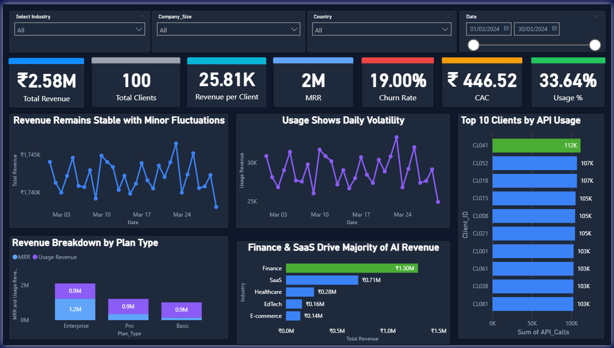

# 🚀 SaaS Analytics Dashboard (Power BI)

> Data-driven dashboard to analyze SaaS business performance including revenue, subscriptions, churn, and growth metrics.

## 📌 Overview
This project simulates a SaaS business environment and provides insights into key metrics such as Monthly Recurring Revenue (MRR), customer growth, churn rate, and product usage.

## 📊 Key Metrics Covered
- Monthly Recurring Revenue (MRR)
- Customer Acquisition
- Churn Rate
- Active Users
- Subscription Plans Performance

## 📁 Dataset
- Simulated SaaS dataset
- Includes user subscriptions, billing data, and usage metrics

## 📊 Key Insights
- Identified trends in customer acquisition and churn
- Analyzed revenue contribution across subscription plans
- Observed patterns in user engagement and growth

## 🛠 Tools Used
- Power BI  
- Excel  

## 📷 Dashboard Preview

## 💼 Business Impact
- Helps SaaS companies track growth and retention
- Supports decision-making for pricing and customer strategy
- Enables monitoring of key business KPIs

## 🚀 How to Use
1. Download the `.pbix` file  
2. Open in Power BI Desktop  
3. Explore SaaS metrics interactively  
